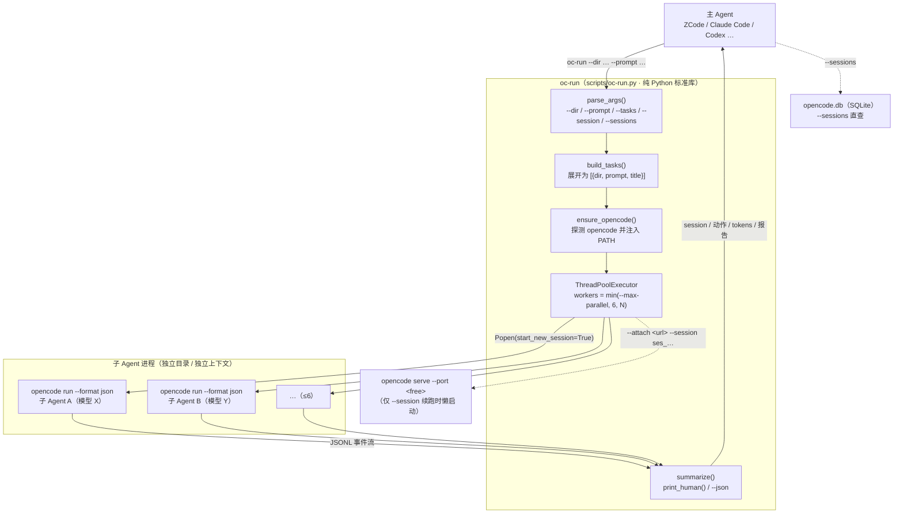
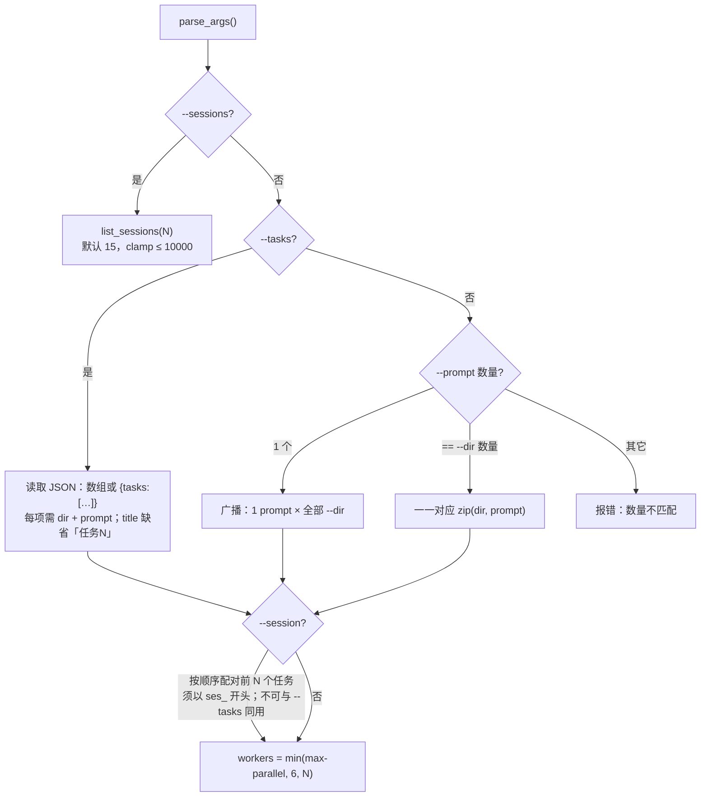
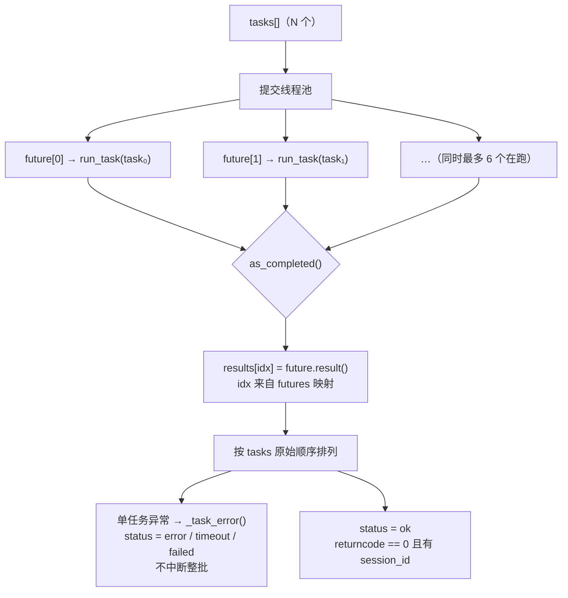
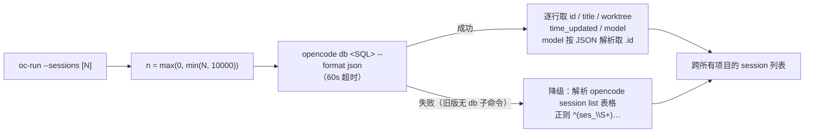

<div align="center">

> [English](./README_en.md) | **简体中文**


# oc-run — 把 OpenCode 变成任意 Harness 的子 Agent

**把你的主 Agent 从模型绑定中解放出来——主 Agent 负责指挥，OpenCode 子 Agent 负责干活，用任何模型，干任何活。**


</div>

---

## 它解决什么问题

一个主 Agent（ZCode / Claude Code / Codex…）最贵的资源，是它自己的上下文与高级模型 token。但真实工作里，大量时间花在"**读一大堆东西、只要一个结论**"——通读一个陌生仓库、批量盘点文件、翻日志找线索、比对几十篇文档。这些活塞进主 Agent，既烧高级 token，又把有限上下文挤满，后面的推理质量随之崩坏。

**oc-run 就是要把这类活外包出去，并且让子 Agent 可以用跟主 Agent 完全不同的模型。** OpenCode 本身 provider 中立——你可以在它里面配好 DeepSeek / GLM / Kimi / Grok / 免费档，甚至自定义 provider 里的 Claude；于是"**强模型做决策、便宜模型干粗活**"第一次变得顺理成章。子 Agent 的搜索、读码、思考全在独立上下文里完成，读再多也不占你一格上下文。

它在技术上只是一层**薄适配器**：给它若干"工作区目录 + 提示词"，它并行派发给独立子 Agent（≤6 个），全部结束后解析 opencode 输出的 JSONL 事件流，回一张结构化汇总——session ID、按工具分组的动作次数、tokens、最终报告。

而原生 `opencode run` 只解决"跑一次"，不解决主 Agent 真正需要的三件事：**并行调度**、**结构化汇总**、**可靠的续跑**。oc-run 把这三件事补齐。

> **隐私与成本**：oc-run 本身不联网、不采集任何数据，只做本地进程调度与结果汇总（唯一会发起网络请求的地方是续跑时对本机 `opencode serve` 的 `GET /health` 就绪探测）。模型请求发往你在 opencode 里配置的 provider，成本完全由你自己的套餐决定。

> **仅支持 OpenCode 1.x**（`opencode` 命令）。OpenCode 2 beta（`opencode2`）请用姊妹项目 **[oc-run2](https://github.com/RayMorTwinkle/oc-run2)**；华为 DevEco Code 请用 **[de-run](https://github.com/RayMorTwinkle/de-run)**。三者 CLI 接口完全一致。

---

## ✨ 功能

- 🎛️ **模型自由**：子 Agent 可用你配置的任意模型（DeepSeek、GLM、Kimi、Grok、免费档，甚至自定义 provider 里的 Claude），完全不绑定主 Agent 同家供应商
- 💰 **省高级 token**："大量读"的活外包给便宜模型；高级模型 token 只花在指挥决策上
- ⚡ **并行派活**：一次最多 **6** 个子 Agent 同时干活，各自独立工作目录与提示词，单任务失败不影响其他任务
- 🔁 **可靠续跑**：`--session` 续跑同一子 Agent，保持它的记忆，按报告循环指挥直到达标（绕开 opencode 1.18.15 的原生 `run --session` 挂起缺陷，见下）
- 📊 **自动汇总**：每个子 Agent 的 session ID、动作次数（按工具分组）、最终报告、tokens，一目了然
- 🔎 **跨项目历史**：`--sessions` 列出**所有 git 项目**的 session（原生 `session list` 只能看到当前项目，会漏）
- 🖼️ **图片 / 文件输入**：读图或附带文件无需额外参数——文件路径写进提示词，子 Agent 自行读取
- 🧩 **任意环境可跑**：内置探测，PATH 精简环境（cron / 脚本 / Agent 子进程）也能找到 `opencode`
- 🪶 **零依赖**：纯 Python 标准库，一个脚本即全部

---

## 🚀 快速开始

### 方式一：面向 AI Agent（一键安装，推荐）

**把下面这段提示词直接复制给你的本地 AI Agent（ZCode / Claude Code / Codex 等），它就能自动完成安装：**

````markdown
请帮我安装 oc-run skill（GitHub: https://github.com/RayMorTwinkle/oc-run）。

背景：oc-run 让任何主 Agent（ZCode/Claude Code/Codex 等）都能把本机的 OpenCode 1.x（opencode）当子 Agent 指挥——并行派活、自动汇总报告、--session 续跑、**子 Agent 可用任意模型，不绑定主 Agent 的模型供应商**。
它依赖本机已安装的 opencode CLI（npm i -g opencode-ai）和 python3。

安装步骤：
1. 下载并解压（如果 ~/.agents/skills/oc-run-subagent 已存在则先跳过，直接验证）：
   curl -L -o /tmp/oc-run.zip https://github.com/RayMorTwinkle/oc-run/archive/refs/heads/main.zip
   unzip -o /tmp/oc-run.zip -d /tmp/ && mv /tmp/oc-run-main ~/.agents/skills/oc-run-subagent
   说明：~/.agents/skills/ 是多个 AI 工具共用的 skill 目录；如果你的平台用别的目录
   （如 Claude Code: ~/.claude/skills/，OpenCode: ~/.config/opencode/skills/），装到对应目录即可。
2. 验证 skill 结构：确认 ~/.agents/skills/oc-run-subagent/SKILL.md 和 scripts/oc-run.py 存在。
3. （可选但推荐）把 oc-run 命令放进 PATH，方便直接调用：
   ln -sf ~/.agents/skills/oc-run-subagent/scripts/oc-run.py ~/.local/bin/oc-run
4. 验证命令：oc-run --help 应输出中文使用说明；若 PATH 里没有，用 python3 ~/.agents/skills/oc-run-subagent/scripts/oc-run.py --help。
5. 端到端测试：oc-run --sessions 3 应列出最近 3 个 session（跨所有 git 项目）。
   若报"未找到 opencode"，请先安装 opencode 或告知用户；oc-run 有内置探测，
   会按常见路径（~/.opencode/bin、fnm、workbuddy、homebrew 等）自动查找。
6. 向用户确认安装成功，并简述 oc-run 的能力：并行派活 / 续跑（--session）/ 跨项目历史（--sessions）/ 模型可选（--model）。
````

### 方式二：面向人类用户

```bash
git clone https://github.com/RayMorTwinkle/oc-run.git
# 或下载 zip: https://github.com/RayMorTwinkle/oc-run/archive/refs/heads/main.zip
```

1. 将 `oc-run` 目录放入智能体的 skill 目录并**重命名为 `oc-run-subagent`**（Claude Code: `~/.claude/skills/`；OpenCode: `~/.config/opencode/skills/`；通用共享: `~/.agents/skills/`）——skill 目录名须与 `SKILL.md` 的 `name` 一致
2. （可选）软链命令到 PATH：
   ```bash
   ln -s "$(pwd)/oc-run/scripts/oc-run.py" ~/.local/bin/oc-run
   ```

> **环境要求**：[OpenCode](https://opencode.ai)（`npm i -g opencode-ai`）+ Python 3.9+。oc-run 本身零第三方依赖。

---

## 🖥️ 使用

### 参数速查

| 参数 | 作用 | 默认 / 约束 |
|---|---|---|
| `--dir <path>` | 工作区目录，可重复 | 与 `--tasks` 二选一 |
| `--prompt <text>` | 提示词，可重复 | 与 `--dir` 按出现顺序配对；只给 1 个则**广播**到所有目录 |
| `--session <id>` | 续跑指定 session，可重复 | 须以 `ses_` 开头；按顺序配前 N 个任务；**不可与 `--tasks` 同用** |
| `--sessions [N]` | 列出最近 N 个 session 后退出 | 默认 15，clamp ≤ 10000；**跨所有项目** |
| `--tasks <file.json>` | 批量任务文件 | 每项 `{dir, prompt, title?}`；与 `--dir/--prompt` **互斥** |
| `--max-parallel N` | 最大并行数 | 默认 6，**上限 6**（超出仅告警并截断） |
| `--model <m>` | 指定模型 `provider/model` | 不传则用 opencode 配置 |
| `--timeout <sec>` | 单任务超时 | 默认 900（15 分钟） |
| `--json` | 汇总输出为 JSON | 含 `summary` + `tasks` |
| `--truncate <n>` | 人类可读输出中每条结果的最大字符数 | 默认不截断（Agent 消费建议保持全文） |

### 典型工作流

```bash
# 单个任务（阻塞执行，跑完输出汇总）
oc-run --dir /path/to/project --prompt "分析这个项目的技术栈"

# 多个任务：工作目录与提示词一一对应（主用法，并行度默认 6、上限 6）
oc-run --dir /path/A --prompt "分析项目A" --dir /path/B --prompt "分析项目B"

# 只给 1 个提示词 = 广播到所有目录
oc-run --dir /path/A --dir /path/B --prompt "用中文简述这个项目"

# 批量任务文件（每任务自定义 dir / prompt / title）
oc-run --tasks tasks.json   # [{"dir": "...", "prompt": "...", "title": "..."}, ...]

# 续跑：接着某个 session 的上下文继续跑
oc-run --sessions                                  # 查看历史 session（跨所有项目）
oc-run --dir /path/A --session ses_xxx --prompt "继续上次的分析"

# 模型切换 + 机器可读输出（给 LLM / 脚本消费）
oc-run --dir /path/A --prompt "..." --json --model opencode-go/deepseek-v4-pro
```

<details>
<summary>📄 输出示例（人类可读）</summary>

```
oc-run 汇总 · 2 个任务 · 并行度 2 · 成功 2/2
────────────────────────────────────────────────────────────────────────
✅ [1] projectA
    session: ses_f7c0ada77ffeCFuvNs5qigdgC6
    动作:   5 次 (glob×1 · grep×2 · read×2)
    tokens: 41,236
    结果:   该项目使用 Python 3.12 + FastAPI …

✅ [2] projectB
    session: ses_f7c0b1e9dffeKq2wMn8stCfWX
    动作:   3 次 (bash×1 · read×2)
    tokens: 22,871
    结果:   主要文件清单如下 …

总耗时: 47.3s
```

</details>

<details>
<summary>📄 输出示例（`--json`）</summary>

```json
{
  "summary": { "total": 2, "parallel": 2, "ok": 2, "elapsed_sec": 47.3 },
  "tasks": [
    {
      "title": "projectA", "dir": "/path/A", "status": "ok",
      "session_id": "ses_f7c0ada77ffeCFuvNs5qigdgC6",
      "actions": { "glob": 1, "grep": 2, "read": 2 }, "total_actions": 5,
      "final_result": "该项目使用 Python 3.12 + FastAPI …",
      "tokens": 41236, "exit_code": 0, "stderr_tail": ""
    }
  ]
}
```

</details>

### 续跑语义（重要）

```bash
# 新任务：子进程以 cwd = --dir 启动，opencode 按该目录解析 project
oc-run --dir /path/A --prompt "..."

# 续跑：工作目录跟随 session 所属目录；此时 --dir 仅作展示/校验，不影响执行
oc-run --dir /path/A --session ses_xxx --prompt "继续…"
```

### 图片 / 文件输入

读图或附带文件**无需任何额外参数**——把文件路径写进提示词，子 Agent 会用工具自行读取：

```bash
oc-run --dir /path --prompt "读取图片 /path/to/img.png 并描述内容" --model opencode/mimo-v2.5-free
```

> 已验证 `opencode/mimo-v2.5-free` 能识别图片内容。

### 🧠 从 LLM / Agent 中调用

把 oc-run 当作可外包的执行单元，**报告是唯一接口**。两种推荐用法：

1. **token 外包（单轮）——大量读、简洁报**：派临时子 Agent 去读海量资料（网页/代码/文档），回报只要简洁结论 + 来源。子 Agent 独立上下文，读再多也不占你的上下文；Flash 便宜，成本可忽略。
2. **主从循环（多轮）——强模型指挥弱模型**：用 `--session` 续跑同一子 Agent（保持记忆），按每次回报决定下一轮，循环直到结果达标。两条铁律：
   - 任务描述要详细：子 Agent 没有你的全局视野，prompt 就是它的世界
   - 回报格式要明确：你只能看到报告 / 最后发言——回报至少包含 **结论 + 来源 + 不确定性 + 未完成项 + 关键函数或举措**

两种用法均可并行（一次派多个，≤6）、可异步（借宿主环境如 ZCode / Claude Code 的后台任务机制，完成自动通知）。

---

## 🏗️ 架构

### 系统总览

主 Agent 只与 `oc-run` 交互；`oc-run` 先用 `ensure_opencode()` 找到 `opencode`，用线程池并行拉起子进程，最后把每个子 Agent 的 JSONL 事件流汇总成一张表。仅当存在 `--session` 续跑时，另行懒启动一个 headless `opencode serve`。



### 任务构建与配对

`build_tasks()` 把三种输入形态统一成 `tasks[]`：`--prompt` 为 1 个时广播，等于 `--dir` 数量时一一对应，其它情况直接报错；再按顺序把 `--session` 绑到前几个任务。



### 并行派发与结果回收

`workers = min(--max-parallel, 6, len(tasks))`，超过上限只告警不使用。每个任务提交为 future，用 `as_completed()` 回收，但**结果始终按 `tasks` 原始顺序输出**（与完成先后无关）。



### 单任务执行时序

每个任务都是一次 `opencode run --format json`，oc-run 解析其 stdout 的 JSONL 事件流。超时按进程组清理，单个任务失败不影响其它任务。

```mermaid
sequenceDiagram
  autonumber
  participant M as 主 Agent
  participant O as oc-run
  participant E as ThreadPoolExecutor
  participant P as opencode run（子进程）

  M->>O: oc-run --dir P --prompt "…"
  O->>O: ensure_opencode() 探测 PATH
  O->>E: submit(run_task)
  E->>P: Popen(opencode run --dir P --format json --title … --dangerously-skip-permissions &lt;prompt&gt;)<br/>start_new_session=True
  P-->>E: stdout: JSONL 事件流
  Note over P,E: tool_use / text / step_finish
  E->>E: summarize()<br/>按工具计数 · 取末条 text · 累加 tokens
  alt 超时（--timeout，默认 900s）
    E->>P: killpg(SIGTERM) → 等 5s
    E->>P: 仍未退 → killpg(SIGKILL)
  end
  E-->>O: {session_id, actions, tokens, final_result}
  O-->>M: 汇总表 / --json
```

### 续跑：`opencode serve` + `--attach` 时序

opencode 1.18.15 的原生 `opencode run --session <id>` 非交互续跑会**零输出挂起**。oc-run 因此改走：懒启动一个 headless `opencode serve`，就绪后让续跑任务 `opencode run --attach <url> --session <id>`——整批复用同一个 serve。

```mermaid
sequenceDiagram
  autonumber
  participant O as oc-run
  participant S as opencode serve（headless）
  participant A as opencode run --attach

  Note over O,S: 仅当存在 --session 时启动；整批复用同一 serve
  O->>O: find_free_port() → 127.0.0.1
  O->>S: Popen(opencode serve --port P --print-logs)<br/>start_new_session=True
  loop 最多 30 × 1s
    O->>S: GET /health
    S-->>O: 200 → 就绪
  end
  O->>A: opencode run --attach &lt;url&gt; --session ses_… &lt;prompt&gt;
  A-->>O: JSONL 事件流（在 session 原上下文续跑）
  Note over O,S: 批次结束 finally → stop_serve() killpg 清理
```

### `--sessions` 数据来源

原生 `opencode session list` 只显示当前 project（cwd 非 git 时归 global，会漏掉其他 git 项目的 session）。oc-run 的 `--sessions` 直接查 opencode 的 SQLite（跨项目列出全部），失败时自动降级回退到表格解析。



---

## 📂 目录结构

```text
oc-run/                      # 仓库名；作为 skill 安装时重命名为 oc-run-subagent
├── SKILL.md                 # 面向 AI 智能体的 skill 定义（name: oc-run-subagent）
├── README.md                # 简体中文说明文件（主文档）
├── README_en.md             # 英文说明文件
├── LICENSE                  # MIT
├── oc-run.svg               # 图标
├── scripts/
│   └── oc-run.py            # 主脚本（纯 Python 标准库，零依赖，569 行）
└── examples/
    └── tasks.example.json   # 批量任务文件模板
```

---

## 🔧 技术细节

**关键常量**（`scripts/oc-run.py`）：

| 常量 | 值 | 含义 |
|---|---|---|
| `PROG` | `"oc-run"` | 程序名（帮助/报错前缀） |
| `DEFAULT_MAX_PARALLEL` / `MAX_PARALLEL_LIMIT` | `6` / `6` | 默认并行度 / 硬上限 |
| `DEFAULT_TIMEOUT` | `900` | 单任务超时（秒） |

**实际并行度**：`workers = min(args.max_parallel, MAX_PARALLEL_LIMIT, len(tasks))`——即便传入更大的 `--max-parallel`，也只告警并截断到 6；任务数比上限少时按任务数。

**子 Agent 命令**（`run_task()` 拼装）：

```text
# 新任务
opencode run --dir <dir> --format json --title <title> --dangerously-skip-permissions [--model <provider/model>] <prompt>

# 续跑（走 serve + attach，绕开原生 --session 挂起）
opencode run --attach <serve_url> --session <ses_…> --format json --dangerously-skip-permissions [--model <provider/model>] <prompt>
```

- `--dangerously-skip-permissions` 自动批准工具权限——派活场景的默认需求；**只读分析类任务请勿让子 Agent 改文件**。
- 子进程以 `start_new_session=True` 启动（独立进程组），超时用 `killpg(SIGTERM)` → 等 5s → `killpg(SIGKILL)` 清理整棵进程树；`Popen(..., errors="replace")` 避免非 UTF-8 输出导致崩溃。

**事件流 schema**（`summarize()` 解析 `opencode run --format json` 的 JSONL，忽略非 JSON 行）：

| 事件 `type` | 提取字段 | 用途 |
|---|---|---|
| 任意含 `sessionID` | `ev["sessionID"]` | 取**首个**出现的 session ID |
| `tool_use` | `part["tool"]` | 按工具名计数（`Counter`） |
| `text` | `part["text"]` | 收集文本，**末条**作为 `final_result` |
| `step_finish` | `part["tokens"]["total"]` | 累加为总 `tokens` |

任务 `status` 判定：`exit_code == 0` **且**拿到 `session_id` → `ok`，否则 `failed`。

**汇总字段**（每个任务）：`title` / `dir` / `status` / `session_id` / `actions`（工具→次数）/ `total_actions` / `final_result` / `tokens` / `exit_code` / `stderr_tail`（stderr 末尾 500 字符）。

**serve 生命周期**（`get_serve()` / `stop_serve()`）：懒启动、进程组独立、全局复用（`_serve_proc` / `_serve_url` / `_serve_lock`）；`serve` 中途崩溃（`poll() is not None`）会自动重置并在下次重启；就绪判定是 `GET /health` 返回成功，最多轮询 **30 × 1s**，失败抛 `RuntimeError`。`find_free_port()` 让内核分配空闲端口（绑定 `127.0.0.1:0`）。`stop_serve()` 在 `main()` 的 `finally` 中无条件执行，保证子进程不残留。

**`--sessions` SQL**：

```sql
SELECT s.id, s.title, p.worktree, s.time_updated, s.model
FROM session s JOIN project p ON s.project_id = p.id
WHERE s.time_archived IS NULL
ORDER BY s.time_updated DESC
LIMIT N   -- clamp: max(0, min(N, 10000))
```

经 `opencode db <query> --format json` 执行（60s 超时）；`model` 字段是 JSON 字符串，取其中 `.id`。`n` 钳制上限 10000（负数在 SQLite 里等于无上限，必须夹取）。降级路径 `list_sessions_legacy()` 用正则 `^(ses_\S+)\s+(.*?)\s+(\d{1,2}:\d{2} [AP]M)$` 解析 `opencode session list` 的表格。时间戳经 `format_ts()` 转成本地 `%m-%d %H:%M`。

**`ensure_opencode()` 探测路径**：先 `shutil.which("opencode")`；落空则依次扫描 `~/.opencode/bin`、`~/.local/bin`、`~/.local/share/fnm/node-versions/*/installation/bin`、`~/.workbuddy/binaries/node/versions/*/bin`、`~/.bun/bin`、`/opt/homebrew/bin`、`/usr/local/bin`，命中后把该目录**前置注入 `PATH`**。`os.path.isfile()` 会自动过滤悬空软链。找不到时直接 `sys.exit` 并提示 `npm i -g opencode-ai`。

**JSON 输出结构**（`--json`）：

```json
{
  "summary": {"total": 2, "parallel": 2, "ok": 2, "elapsed_sec": 47.3},
  "tasks": [{"title":"…","dir":"…","status":"ok","session_id":"ses_…",
             "actions":{"read":6,"grep":2},"total_actions":8,
             "final_result":"…","tokens":41236,"exit_code":0,"stderr_tail":""}]
}
```

**人类可读输出**：头部 `oc-run 汇总 · N 个任务 · 并行度 W · 成功 X/N`，逐任务带状态图标（`ok` ✅ / `failed` ❌ / `timeout` ⏱ / `error` ⚠️）、session、**按工具名排序**的动作统计、tokens、结果或错误摘要，结尾输出总耗时。错误任务的 `final_result` 兜底顺序为 `final_result → stderr_tail → "未知错误"`。

**依赖**：仅标准库——`argparse` / `glob` / `json` / `os` / `re` / `shutil` / `signal` / `socket` / `subprocess` / `sys` / `threading` / `time` / `urllib.request` / `collections.Counter` / `concurrent.futures`。

---

## ❓ 常见问题

**Q: 为什么不用原生 `opencode run` 直接跑？**
A: 原生命令只解决"跑一次"；oc-run 补上三件主 Agent 真正需要的事：**上下文隔离**（子 Agent 读 48 万 tokens 资料，你的上下文一滴不占）、**模型自由**（`--model` 任意切，不绑定主 Agent 供应商）、**并行调度 + 结构化汇总**（一次派 6 个，统一收报告）。

**Q: "模型自由"具体指什么？**
A: OpenCode 本身是 provider 中立的中转。你可以在 opencode 配置里接任意模型服务，oc-run 的子 Agent 就能用它们——包括主 Agent（如 Claude Code）供应商之外的 DeepSeek、GLM、Kimi、Grok、免费档，甚至自定义 provider 里的 Claude。高级模型只留给主 Agent 指挥，跑量的活交给便宜的。

**Q: oc-run 和 oc-run2 / de-run 什么关系？装哪个？**

| | oc-run | [oc-run2](https://github.com/RayMorTwinkle/oc-run2) | [de-run](https://github.com/RayMorTwinkle/de-run) |
|---|---|---|---|
| 底层子 Agent | OpenCode 1.x（`opencode`） | OpenCode 2 beta（`opencode2`） | 华为 DevEco Code（`deveco`） |
| 续跑 `--session` | `serve` + `--attach` 绕行 | 原生支持 | `serve` + HTTP API 绕行 |
| 跨项目历史 | `opencode db` 直查 SQLite | 官方 API | 只读直查 `deveco.db` |
| 模型 | 模型自由（自带 provider） | 模型自由 + `--variant` | 华为账号免费 GLM-5.1 + 可换 |
| 花费统计 | 仅 tokens | tokens + **cost（美元）** | 仅 tokens（免费无花费） |
| 鸿蒙工具链 | 无 | 无 | **内置**（ArkTS 检查/编译/真机） |

A: 你机器上装的是哪个就装哪个：`opencode`（1.x stable）→ oc-run；`opencode2`（2.0 beta）→ oc-run2；用 DevEco Code → de-run。三者可并存，CLI 接口一致、命令互不冲突。

**Q: oc-run、oc-run-subagent、仓库名是什么关系？**
A: 命令叫 `oc-run`，skill 名叫 `oc-run-subagent`（skill 目录名与 SKILL.md 的 `name` 一致），GitHub 仓库名 `oc-run`。装好 skill 后，用命令、用 skill 触发都指向同一个工具。

**Q: 子 Agent 会乱改我的文件吗？**
A: `opencode run` 自动携带 `--dangerously-skip-permissions`（自动批准权限），这是派活场景的默认需求。只读分析类任务请约束提示词（"只分析，不要修改任何文件"），或在 opencode 配置里收紧权限。

**Q: 高并行会互相干扰吗？**
A: 各任务独立进程、独立目录、独立 session，互不干扰。唯一的跨任务共享是续跑用的 `opencode serve`（仅批次内时长存在）。实际并发以 `min(--max-parallel, 6, 任务数)` 为准。

**Q: 续跑时还要指定 `--dir` 吗？**
A: 指定了只为展示/校验用，不影响执行——续跑的工作目录由 session 原属目录决定。`--session` 也不能与 `--tasks` 同时使用，且 session ID 必须以 `ses_` 开头、数量不能超过任务数。

---

## ⚠️ 注意事项

- 仅支持 **OpenCode 1.x**（`opencode`）；OpenCode 2 beta 请用 oc-run2。
- 自动携带 `--dangerously-skip-permissions`（自动批准权限）——请自行确保任务范围与提示词可控。
- **原生 `opencode run --session <id>` 非交互续跑在 1.18.15 会挂起**（零输出）：oc-run 已通过 `opencode serve` + `--attach` 绕开，无需手动处理。
- **`opencode session list` 只显示当前 project 的 session**：oc-run 的 `--sessions` 直接查 SQLite 跨项目列出全部，失败时自动降级。
- `--max-parallel` 硬上限为 6，超出仅告警并按 6 执行。
- 续跑若失败：先确认本机没有卡死的 `opencode` 交互窗口占用 SQLite 锁，再重试；`stop_serve()` 已在 `finally` 中保证清理子进程。

---

## 🤝 姊妹项目

- **[oc-run2](https://github.com/RayMorTwinkle/oc-run2)** — OpenCode 2 beta（`opencode2`）版：续跑改由原生 `--session` 支持，历史走官方 API，汇总多一列 cost（美元），并新增 `--agent` / `--variant`。
- **[de-run](https://github.com/RayMorTwinkle/de-run)** — 把华为 DevEco Code（deveco）当子 Agent：**登录华为账号即送免费 GLM-5.1 模型通道**（无需自己的 API key，单账号 50 次/分钟），并内置鸿蒙官方开发能力（ArkTS 检查/编译构建/真机模拟器）。

三者 CLI 接口一致，可并存、按任务选用。

---

## 📄 License

MIT

---

## 🙏 致谢 / Credits

- 底层能力来自 **[OpenCode](https://opencode.ai)**（`opencode` CLI）——本项目不修改其本体，仅做本地调度适配；事件流 schema（JSONL）即其 `--format json` 输出。
- 图标、README（中英双语）与架构图为本项目自制。

---

<div align="center">
<sub>oc-run · 强模型做决策，便宜模型干粗活</sub>
</div>
