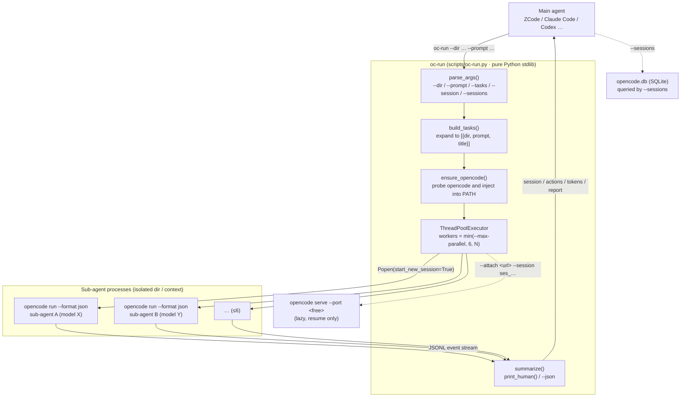
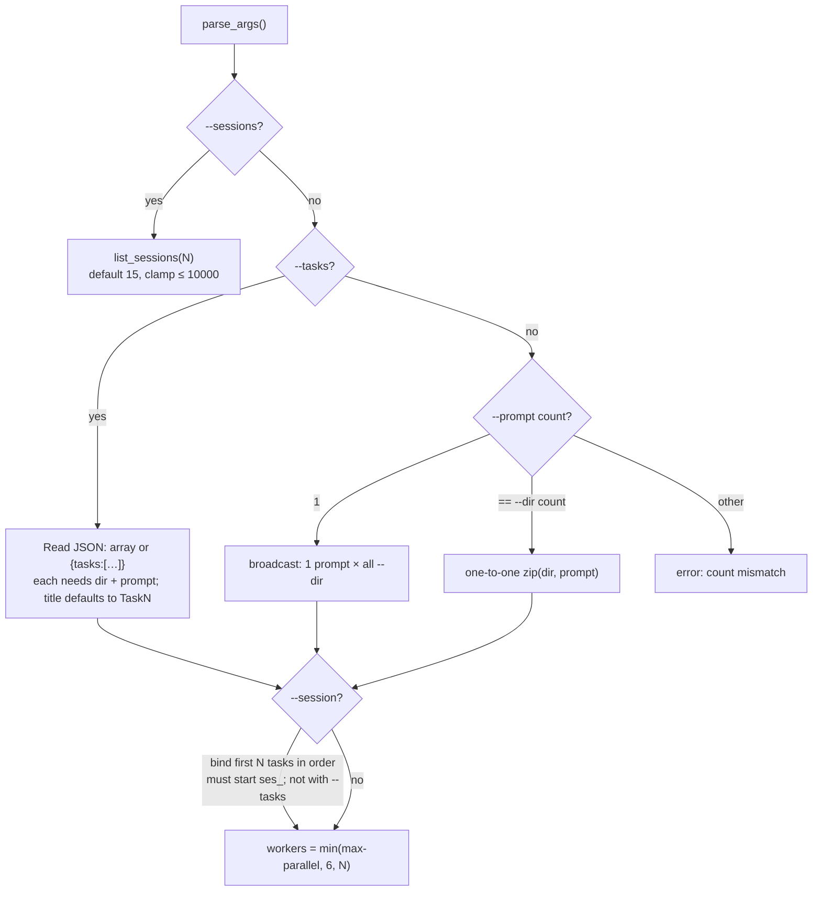
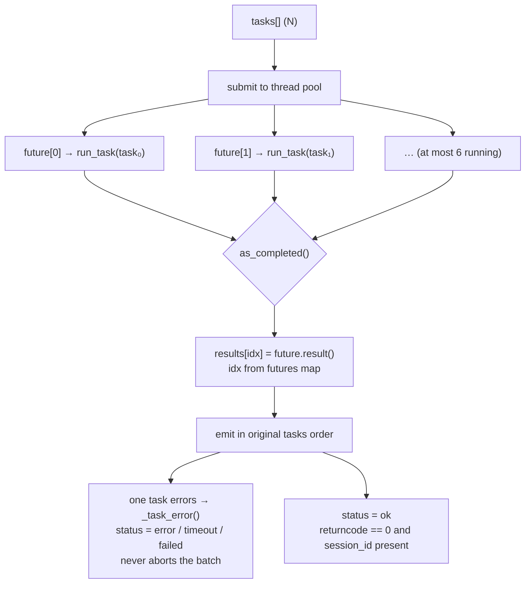
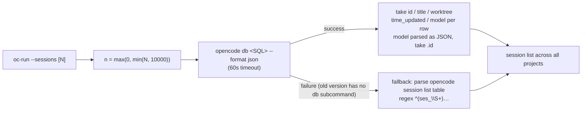

<div align="center">

> English | [简体中文](./README.md)


# oc-run — OpenCode as sub-agents for any harness

**Free your main agent from model lock-in — the main agent commands, OpenCode sub-agents do the work, with any model you want.**


</div>

---

## Why it exists

A main agent's (ZCode / Claude Code / Codex …) most expensive resource is its own context and premium-model tokens. Yet real work spends a lot of time on "**read a huge amount, want only one conclusion**" — understanding an unfamiliar repo, inventorying files in bulk, digging through logs for a clue, comparing dozens of docs. Doing that work inside the main agent burns premium tokens and fills up a limited context, and the reasoning quality degrades.

**oc-run exists to offload that kind of work — and to let sub-agents use a completely different model than the main agent.** OpenCode itself is provider-agnostic: configure DeepSeek / GLM / Kimi / Grok / free tiers, even Claude via a custom provider, and "**premium model decides, cheap model grinds**" becomes natural. Sub-agents search, read and reason entirely in isolated contexts — reading never costs you a single slot of context.

Technically it's just a **thin adapter**: give it workspace dirs + prompts, it dispatches parallel sub-agents (≤6), then parses OpenCode's JSONL event stream and returns a structured summary — session ID, tool calls grouped by tool, tokens, and the final report.

Native `opencode run` only handles "run once"; it doesn't solve the three things a main agent actually needs: **parallel dispatch**, **structured aggregation**, and **reliable resume**. oc-run fills those three in.

> **Privacy & cost**: oc-run itself makes no network calls and collects no data — it only does local process scheduling and result aggregation (the sole network request is the `GET /health` readiness probe against the local `opencode serve` during resume). Model requests go to whatever provider you configured in opencode; cost is entirely determined by your own plan.

> **OpenCode 1.x only** (the `opencode` command). For OpenCode 2 beta (`opencode2`) use the sibling project **[oc-run2](https://github.com/RayMorTwinkle/oc-run2)**; for Huawei DevEco Code use **[de-run](https://github.com/RayMorTwinkle/de-run)**. All three share an identical CLI.

---

## ✨ Features

- 🎛️ **Model freedom**: sub-agents can use any model you configure (DeepSeek, GLM, Kimi, Grok, free tiers, even Claude via a custom provider), never locked to your main agent's vendor
- 💰 **Save premium tokens**: offload the "read a lot" work to cheap models; premium tokens are spent only on commanding and deciding
- ⚡ **Parallel dispatch**: up to **6** sub-agents at once, each with its own workspace dir and prompt; one task's failure never affects the others
- 🔁 **Reliable resume**: `--session` resumes the same sub-agent, keeping its memory, so you iterate until the result is good (works around OpenCode 1.18.15's native `run --session` hang — see below)
- 📊 **Auto summary**: each sub-agent's session ID, tool calls (grouped by tool), final report, tokens — at a glance
- 🔎 **Cross-project history**: `--sessions` lists sessions across **all git projects** (native `session list` only shows the current one and misses the rest)
- 🖼️ **Image / file input**: reading an image or attaching a file needs no extra flag — put the path in the prompt and the sub-agent reads it
- 🧩 **Runs anywhere**: built-in probe finds `opencode` even in stripped-PATH environments (cron / scripts / agent subprocesses)
- 🪶 **Zero dependencies**: pure Python stdlib, a single script is the whole thing

---

## 🚀 Quick start

### Option 1: For AI agents (one-shot install, recommended)

**Copy this prompt to your local AI agent (ZCode / Claude Code / Codex etc.) and it will install everything:**

````markdown
Install the oc-run skill (GitHub: https://github.com/RayMorTwinkle/oc-run).

Background: oc-run lets any main agent (ZCode / Claude Code / Codex etc.) command the local OpenCode 1.x (opencode) as sub-agents — parallel dispatch, auto-summarized reports, --session resume, and **sub-agents can use any model, not locked to your main agent's vendor**.
It requires the opencode CLI (npm i -g opencode-ai) and python3.

Steps:
1. Download and extract (skip if ~/.agents/skills/oc-run-subagent already exists):
   curl -L -o /tmp/oc-run.zip https://github.com/RayMorTwinkle/oc-run/archive/refs/heads/main.zip
   unzip -o /tmp/oc-run.zip -d /tmp/ && mv /tmp/oc-run-main ~/.agents/skills/oc-run-subagent
   Note: ~/.agents/skills/ is a shared skill dir; if your platform uses another
   (Claude Code: ~/.claude/skills/, OpenCode: ~/.config/opencode/skills/), install there instead.
2. Verify: ~/.agents/skills/oc-run-subagent/SKILL.md and scripts/oc-run.py exist.
3. (Optional but recommended) Put oc-run on PATH:
   ln -sf ~/.agents/skills/oc-run-subagent/scripts/oc-run.py ~/.local/bin/oc-run
4. Verify: `oc-run --help` prints the Chinese usage guide; fallback: python3 ~/.agents/skills/oc-run-subagent/scripts/oc-run.py --help.
5. End-to-end test: `oc-run --sessions 3` lists the 3 most recent sessions (across all git projects).
   If it says "opencode not found", install opencode first; oc-run auto-probes common paths
   (~/.opencode/bin, fnm, workbuddy, homebrew, ...).
6. Confirm to the user and summarize oc-run capabilities: parallel dispatch / resume (--session) /
   cross-project history (--sessions) / model selection (--model).
````

### Option 2: For humans

```bash
git clone https://github.com/RayMorTwinkle/oc-run.git
# or download zip: https://github.com/RayMorTwinkle/oc-run/archive/refs/heads/main.zip
```

1. Put the `oc-run` folder into your agent's skill directory and **rename it to `oc-run-subagent`** (Claude Code: `~/.claude/skills/`, OpenCode: `~/.config/opencode/skills/`, shared: `~/.agents/skills/`) — the skill dir name must match the `name` in `SKILL.md`
2. (Optional) Symlink to PATH:
   ```bash
   ln -s "$(pwd)/oc-run/scripts/oc-run.py" ~/.local/bin/oc-run
   ```

> **Requirements**: [OpenCode](https://opencode.ai) (`npm i -g opencode-ai`) + Python 3.9+. oc-run itself has zero third-party dependencies.

---

## 🖥️ Usage

### Parameter reference

| Flag | Purpose | Default / constraint |
|---|---|---|
| `--dir <path>` | Workspace dir, repeatable | Mutually exclusive with `--tasks` |
| `--prompt <text>` | Prompt, repeatable | Paired with `--dir` in order; a single one is **broadcast** to all dirs |
| `--session <id>` | Resume a session, repeatable | Must start with `ses_`; bound to the first N tasks in order; **cannot be combined with `--tasks`** |
| `--sessions [N]` | List the N most recent sessions, then exit | Default 15, clamped ≤ 10000; **across all projects** |
| `--tasks <file.json>` | Batch task file | Each item `{dir, prompt, title?}`; **exclusive** with `--dir/--prompt` |
| `--max-parallel N` | Max parallelism | Default 6, **hard cap 6** (excess only warns and is truncated) |
| `--model <m>` | Model `provider/model` | Falls back to opencode config |
| `--timeout <sec>` | Per-task timeout | Default 900 (15 min) |
| `--json` | Emit the summary as JSON | Contains `summary` + `tasks` |
| `--truncate <n>` | Max chars per result in human output | No truncation by default (keep full text for agents) |

### Typical workflows

```bash
# Single task (blocking, prints the summary when done)
oc-run --dir /path/to/project --prompt "Analyze the tech stack"

# Multiple tasks: dirs and prompts paired one-to-one (main usage, up to 6 in parallel)
oc-run --dir /path/A --prompt "Analyze A" --dir /path/B --prompt "Analyze B"

# A single prompt = broadcast to all dirs
oc-run --dir /path/A --dir /path/B --prompt "One-line intro, please"

# Batch task file (per-task dir / prompt / title)
oc-run --tasks tasks.json   # [{"dir": "...", "prompt": "...", "title": "..."}, ...]

# Resume a session (multi-round iteration)
oc-run --sessions                                  # list history (all projects)
oc-run --dir /path/A --session ses_xxx --prompt "Continue from last round"

# Model selection + machine-readable output (for LLMs / scripts)
oc-run --dir /path/A --prompt "..." --json --model opencode-go/deepseek-v4-pro
```

<details>
<summary>📄 Sample output (human-readable)</summary>

```
oc-run 汇总 · 2 个任务 · 并行度 2 · 成功 2/2
────────────────────────────────────────────────────────────────────────
✅ [1] projectA
    session: ses_f7c0ada77ffeCFuvNs5qigdgC6
    动作:   5 次 (glob×1 · grep×2 · read×2)
    tokens: 41,236
    结果:   该项目使用 Python 3.12 + FastAPI …

✅ [2] projectB
    session: ses_f7c0b1e9dffeKq2wMn8stCfWX
    动作:   3 次 (bash×1 · read×2)
    tokens: 22,871
    结果:   主要文件清单如下 …

总耗时: 47.3s
```

</details>

<details>
<summary>📄 Sample output (`--json`)</summary>

```json
{
  "summary": { "total": 2, "parallel": 2, "ok": 2, "elapsed_sec": 47.3 },
  "tasks": [
    {
      "title": "projectA", "dir": "/path/A", "status": "ok",
      "session_id": "ses_f7c0ada77ffeCFuvNs5qigdgC6",
      "actions": { "glob": 1, "grep": 2, "read": 2 }, "total_actions": 5,
      "final_result": "This project uses Python 3.12 + FastAPI …",
      "tokens": 41236, "exit_code": 0, "stderr_tail": ""
    }
  ]
}
```

</details>

### Resume semantics (important)

```bash
# New task: the subprocess starts with cwd = --dir; opencode resolves the project from it
oc-run --dir /path/A --prompt "..."

# Resume: the working dir follows the session's own directory; --dir is display/validation only
oc-run --dir /path/A --session ses_xxx --prompt "Continue…"
```

### Image / file input

Reading an image or attaching a file needs **no extra flag** — put the path in the prompt and the sub-agent reads it with its own tools:

```bash
oc-run --dir /path --prompt "Read the image /path/to/img.png and describe it" --model opencode/mimo-v2.5-free
```

> Verified: `opencode/mimo-v2.5-free` can recognize image content.

### 🧠 Calling from an LLM / agent

Treat oc-run as an offloadable execution unit; **the report is the only interface**. Two recommended patterns:

1. **Token offloading (one round) — read a lot, report briefly**: send a temporary sub-agent to read huge material (web/code/docs) and report only concise conclusions + sources. The sub-agent's context is isolated; reading never touches yours. Cheap on Flash, negligible cost.
2. **Master–worker loop (multi-round) — a strong model commands a weak one**: resume the same sub-agent with `--session` (keeping its memory), deciding the next round from each report, until the result is good. Two iron rules:
   - Give detailed task descriptions: the sub-agent has no global view — the prompt is its world.
   - Demand a strict report format: you only see the report / last message — it should contain at least **conclusion + sources + uncertainties + unfinished items + key functions/actions**.

Both patterns support parallelism (≤6) and async execution (the host's background-task mechanism, e.g. ZCode / Claude Code, with completion notification).

---

## 🏗️ Architecture

### System overview

The main agent only talks to `oc-run`; `oc-run` first uses `ensure_opencode()` to locate `opencode`, then uses a thread pool to launch subprocesses and finally aggregates each sub-agent's JSONL event stream into one table. Only when a `--session` resume is present does it lazily start a headless `opencode serve`.



### Task building and pairing

`build_tasks()` unifies three input shapes into `tasks[]`: a single `--prompt` is broadcast, a count equal to `--dir` is paired one-to-one, anything else errors; then `--session` is bound to the first N tasks in order.



### Parallel dispatch and collection

`workers = min(--max-parallel, 6, len(tasks))` — exceeding the cap only warns and is not used. Each task is submitted as a future and collected with `as_completed()`, but **results are always emitted in the original `tasks` order** (regardless of completion order).



### Single-task execution timeline

Each task is one `opencode run --format json`; oc-run parses its stdout JSONL event stream. Timeouts are cleaned up by process group, and one task's failure doesn't affect the others.

```mermaid
sequenceDiagram
  autonumber
  participant M as Main agent
  participant O as oc-run
  participant E as ThreadPoolExecutor
  participant P as opencode run (subprocess)

  M->>O: oc-run --dir P --prompt "…"
  O->>O: ensure_opencode() probe PATH
  O->>E: submit(run_task)
  E->>P: Popen(opencode run --dir P --format json --title … --dangerously-skip-permissions &lt;prompt&gt;)<br/>start_new_session=True
  P-->>E: stdout: JSONL event stream
  Note over P,E: tool_use / text / step_finish
  E->>E: summarize()<br/>count by tool · last text · sum tokens
  alt timeout (--timeout, default 900s)
    E->>P: killpg(SIGTERM) → wait 5s
    E->>P: still alive → killpg(SIGKILL)
  end
  E-->>O: {session_id, actions, tokens, final_result}
  O-->>M: summary table / --json
```

### Resume: `opencode serve` + `--attach` timeline

In OpenCode 1.18.15, native `opencode run --session <id>` hangs with zero output in non-interactive resume. oc-run therefore: lazily starts a headless `opencode serve`, waits for readiness, and resumes via `opencode run --attach <url> --session <id>` — the whole batch reuses one serve.

```mermaid
sequenceDiagram
  autonumber
  participant O as oc-run
  participant S as opencode serve (headless)
  participant A as opencode run --attach

  Note over O,S: started only when --session is present; one serve per batch
  O->>O: find_free_port() → 127.0.0.1
  O->>S: Popen(opencode serve --port P --print-logs)<br/>start_new_session=True
  loop up to 30 × 1s
    O->>S: GET /health
    S-->>O: 200 → ready
  end
  O->>A: opencode run --attach &lt;url&gt; --session ses_… &lt;prompt&gt;
  A-->>O: JSONL event stream (resumed in original session context)
  Note over O,S: batch end finally → stop_serve() killpg cleanup
```

### Where `--sessions` gets its data

Native `opencode session list` only shows the current project (a non-git cwd falls under global and misses sessions of other git projects). oc-run's `--sessions` queries OpenCode's SQLite directly (listing across all projects), with an automatic fallback to table parsing.



---

## 📂 Project layout

```text
oc-run/                      # repo name; rename to oc-run-subagent when installing as a skill
├── SKILL.md                 # agent skill definition (name: oc-run-subagent)
├── README.md                # 简体中文 docs (primary)
├── README_en.md             # English docs
├── LICENSE                  # MIT
├── oc-run.svg               # icon
├── scripts/
│   └── oc-run.py            # main script (pure Python stdlib, zero deps, 569 lines)
└── examples/
    └── tasks.example.json   # batch-task template
```

---

## 🔧 Technical notes

**Key constants** (`scripts/oc-run.py`):

| Constant | Value | Meaning |
|---|---|---|
| `PROG` | `"oc-run"` | Program name (help/error prefix) |
| `DEFAULT_MAX_PARALLEL` / `MAX_PARALLEL_LIMIT` | `6` / `6` | Default parallelism / hard cap |
| `DEFAULT_TIMEOUT` | `900` | Per-task timeout (seconds) |

**Effective parallelism**: `workers = min(args.max_parallel, MAX_PARALLEL_LIMIT, len(tasks))` — even if you pass a larger `--max-parallel`, it's only warned and truncated to 6; fewer tasks than the cap runs at task count.

**Sub-agent commands** (assembled by `run_task()`):

```text
# New task
opencode run --dir <dir> --format json --title <title> --dangerously-skip-permissions [--model <provider/model>] <prompt>

# Resume (via serve + attach, to dodge the native --session hang)
opencode run --attach <serve_url> --session <ses_…> --format json --dangerously-skip-permissions [--model <provider/model>] <prompt>
```

- `--dangerously-skip-permissions` auto-approves tool permissions — the default need for offloading; **do not let sub-agents modify files in read-only analysis tasks**.
- Subprocesses start with `start_new_session=True` (own process group); timeouts use `killpg(SIGTERM)` → wait 5s → `killpg(SIGKILL)` to clean the whole tree; `Popen(..., errors="replace")` avoids crashes on non-UTF-8 output.

**Event-stream schema** (`summarize()` parses `opencode run --format json` JSONL, ignoring non-JSON lines):

| Event `type` | Field | Use |
|---|---|---|
| any with `sessionID` | `ev["sessionID"]` | take the **first** session ID |
| `tool_use` | `part["tool"]` | count per tool name (`Counter`) |
| `text` | `part["text"]` | collect text; the **last** one becomes `final_result` |
| `step_finish` | `part["tokens"]["total"]` | accumulate into `tokens` |

Task `status` rule: `exit_code == 0` **and** a `session_id` → `ok`, else `failed`.

**Summary fields** (per task): `title` / `dir` / `status` / `session_id` / `actions` (tool→count) / `total_actions` / `final_result` / `tokens` / `exit_code` / `stderr_tail` (last 500 chars of stderr).

**Serve lifecycle** (`get_serve()` / `stop_serve()`): lazy start, own process group, globally reused (`_serve_proc` / `_serve_url` / `_serve_lock`); if the serve dies mid-way (`poll() is not None`) it's reset and restarted next time; readiness is `GET /health` succeeding, polled at most **30 × 1s**, otherwise raises `RuntimeError`. `find_free_port()` lets the kernel pick a free port (bind `127.0.0.1:0`). `stop_serve()` runs unconditionally in `main()`'s `finally`, so no child process is left behind.

**`--sessions` SQL**:

```sql
SELECT s.id, s.title, p.worktree, s.time_updated, s.model
FROM session s JOIN project p ON s.project_id = p.id
WHERE s.time_archived IS NULL
ORDER BY s.time_updated DESC
LIMIT N   -- clamp: max(0, min(N, 10000))
```

Run via `opencode db <query> --format json` (60s timeout); the `model` field is a JSON string, from which `.id` is taken. `n` is clamped at 10000 (a negative value means no limit in SQLite, so clamping is required). The fallback `list_sessions_legacy()` parses the `opencode session list` table with the regex `^(ses_\S+)\s+(.*?)\s+(\d{1,2}:\d{2} [AP]M)$`. Timestamps go through `format_ts()` into local `%m-%d %H:%M`.

**`ensure_opencode()` probe paths**: first `shutil.which("opencode")`; if that misses, it scans `~/.opencode/bin`, `~/.local/bin`, `~/.local/share/fnm/node-versions/*/installation/bin`, `~/.workbuddy/binaries/node/versions/*/bin`, `~/.bun/bin`, `/opt/homebrew/bin`, `/usr/local/bin` in turn, and prepends the hit directory to `PATH`. `os.path.isfile()` filters out dangling symlinks. If nothing is found it `sys.exit`s with a hint to `npm i -g opencode-ai`.

**JSON output shape** (`--json`):

```json
{
  "summary": {"total": 2, "parallel": 2, "ok": 2, "elapsed_sec": 47.3},
  "tasks": [{"title":"…","dir":"…","status":"ok","session_id":"ses_…",
             "actions":{"read":6,"grep":2},"total_actions":8,
             "final_result":"…","tokens":41236,"exit_code":0,"stderr_tail":""}]
}
```

**Human-readable output**: header `oc-run 汇总 · N 个任务 · 并行度 W · 成功 X/N`, then per task: status icon (`ok` ✅ / `failed` ❌ / `timeout` ⏱ / `error` ⚠️), session, actions **sorted by tool name**, tokens, and result or error summary; ends with total elapsed time. An errored task's `final_result` falls back in order `final_result → stderr_tail → "未知错误"`.

**Dependencies**: stdlib only — `argparse` / `glob` / `json` / `os` / `re` / `shutil` / `signal` / `socket` / `subprocess` / `sys` / `threading` / `time` / `urllib.request` / `collections.Counter` / `concurrent.futures`.

---

## ❓ FAQ

**Q: Why not just run native `opencode run` directly?**
A: Native handles "run once"; oc-run adds the three things a main agent actually needs: **context isolation** (a sub-agent can burn 480K tokens of reading without touching your context), **model freedom** (`--model` switches freely, no vendor lock-in), and **parallel dispatch + structured summary** (6 at once, one report).

**Q: What does "model freedom" mean exactly?**
A: OpenCode is a provider-agnostic relay. Configure any model service in opencode and sub-agents can use it — DeepSeek, GLM, Kimi, Grok, free tiers, even Claude via a custom provider, regardless of your main agent's vendor. Keep premium models for commanding; hand the heavy reading to cheap ones.

**Q: What's the relationship between oc-run, oc-run2 and de-run? Which should I install?**

| | oc-run | [oc-run2](https://github.com/RayMorTwinkle/oc-run2) | [de-run](https://github.com/RayMorTwinkle/de-run) |
|---|---|---|---|
| Underlying sub-agent | OpenCode 1.x (`opencode`) | OpenCode 2 beta (`opencode2`) | Huawei DevEco Code (`deveco`) |
| Resume `--session` | `serve` + `--attach` workaround | native | `serve` + HTTP API workaround |
| Cross-project history | `opencode db` SQLite query | official API | read-only `deveco.db` query |
| Model | model freedom (own providers) | model freedom + `--variant` | free GLM-5.1 with Huawei account + swappable |
| Cost stats | tokens only | tokens + **cost (USD)** | tokens only (free, no cost) |
| HarmonyOS toolchain | no | no | **built in** (ArkTS check / build / device) |

A: Install whichever matches your machine: `opencode` (1.x stable) → oc-run; `opencode2` (2.0 beta) → oc-run2; DevEco Code → de-run. All three can coexist — same CLI, non-conflicting commands.

**Q: oc-run vs oc-run-subagent vs the repo name?**
A: The command is `oc-run`, the skill is `oc-run-subagent` (skill dir must match the `name` in SKILL.md), the GitHub repo is `oc-run`. After install, the command and the skill both drive the same tool.

**Q: Will sub-agents mess with my files?**
A: `opencode run` automatically carries `--dangerously-skip-permissions` (auto-approve), which is the default need for offloading. For read-only analysis, constrain the prompt ("analyze only, do not modify any files") or tighten permissions in your opencode config.

**Q: Do high-parallelism tasks interfere with each other?**
A: No — each task has its own process, dir and session. The only thing shared across tasks is the `opencode serve` used for resume (and only for the batch's lifetime). Effective concurrency is `min(--max-parallel, 6, task count)`.

**Q: Do I still need `--dir` when resuming?**
A: It's for display/validation only and doesn't affect execution — the resume working dir follows the session's own directory. `--session` also can't be combined with `--tasks`, the ID must start with `ses_`, and the count can't exceed the task count.

---

## ⚠️ Notes

- **OpenCode 1.x only** (`opencode`); for OpenCode 2 beta use oc-run2.
- Automatically carries `--dangerously-skip-permissions` (auto-approve) — make sure the task scope and prompt are under control.
- **Native `opencode run --session <id>` hangs with zero output in 1.18.15**: oc-run already works around it with `opencode serve` + `--attach` — no manual action needed.
- **`opencode session list` only shows the current project's sessions**: oc-run's `--sessions` queries SQLite directly across all projects, with automatic fallback.
- `--max-parallel` has a hard cap of 6; excess only warns and runs at 6.
- If resume fails: first make sure no stuck `opencode` interactive window holds the SQLite lock, then retry; `stop_serve()` already guarantees child cleanup in `finally`.

---

## 🤝 Sibling projects

- **[oc-run2](https://github.com/RayMorTwinkle/oc-run2)** — the OpenCode 2 beta (`opencode2`) edition: native `--session` resume, history via the official API, a cost (USD) column in the summary, plus `--agent` / `--variant`.
- **[de-run](https://github.com/RayMorTwinkle/de-run)** — Huawei DevEco Code (deveco) as sub-agents: **free GLM-5.1 model channel just for signing in with a Huawei account** (no API key needed, 50 req/min), plus the official HarmonyOS toolchain (ArkTS checks / build & run / emulators).

All three share the same CLI and can coexist — pick per task.

---

## 📄 License

MIT

---

## 🙏 Credits

- Underlying capability comes from **[OpenCode](https://opencode.ai)** (the `opencode` CLI) — this project doesn't modify it, only adapts local scheduling; the event-stream schema (JSONL) is its `--format json` output.
- The icon, READMEs (bilingual) and architecture diagrams are original to this project.

---

<div align="center">
<sub>oc-run · a strong model decides, cheap models grind</sub>
</div>
